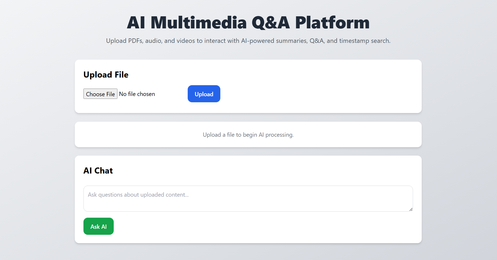
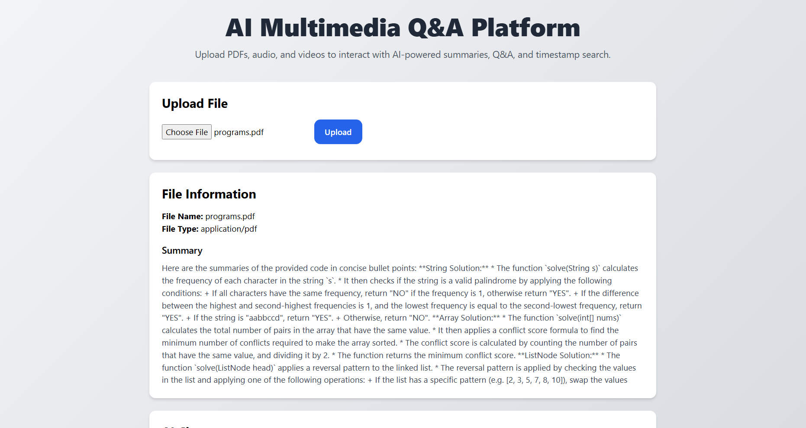
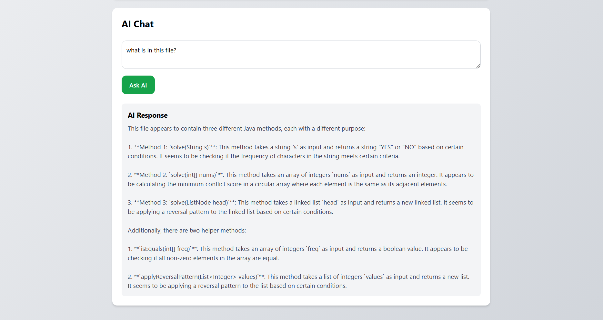

# AI Multimedia Q&A Platform

An AI-powered full-stack application that enables users to upload PDF documents, audio files, and video files to perform intelligent summarization, question answering, transcript analysis, and timestamp-based multimedia navigation.

---

# Features

## PDF Processing

* Upload PDF documents
* Extract document text
* Generate AI-powered summaries
* Ask contextual questions from uploaded documents

## Audio & Video Processing

* Upload MP3 and MP4 files
* AI-based transcript processing
* Timestamp extraction architecture
* Topic-based timestamp search
* Multimedia playback from relevant timestamps

## AI Features

* AI-generated summaries
* AI-powered contextual Q&A
* Multimedia transcript search
* Real-time response generation using Groq LLM APIs

## Engineering Features

* RESTful API architecture
* React frontend with responsive UI
* Spring Boot backend
* MySQL database integration
* Automated testing with JaCoCo coverage reporting
* Docker-ready deployment architecture

---

# Tech Stack

## Frontend

* React.js
* Vite
* Tailwind CSS
* Axios
* React Player

## Backend

* Java 21
* Spring Boot
* Spring Data JPA
* Maven

## Database

* MySQL

## AI & Multimedia

* Groq API
* FFmpeg
* AssemblyAI integration architecture

## Testing

* JUnit
* Mockito
* JaCoCo

---

# System Architecture

Frontend (React)
↓
REST APIs
↓
Spring Boot Backend
↓
AI Services + MySQL Database

---

# Setup Instructions

## Backend Setup

```bash
mvn clean install
mvn spring-boot:run
```

Backend runs on:

```text
http://localhost:8080
```

---

## Frontend Setup

```bash
npm install
npm run dev
```

Frontend runs on:

```text
http://localhost:5173
```

---

# API Endpoints

## Upload File

```http
POST /api/files/upload
```

## Ask AI Question

```http
POST /api/chat/ask
```

## Timestamp Search

```http
GET /api/timestamps/search
```

---

# Testing & Coverage

* Unit testing implemented using JUnit and Mockito
* Automated coverage reporting using JaCoCo
* External AI services mocked during testing
* Coverage includes service and controller layers

---

# Future Improvements

* Real-time streaming transcription
* Vector database integration
* Semantic search using embeddings
* Authentication & authorization
* Cloud deployment
* Advanced AI summarization pipelines

---

# Screenshots




---

# Author

Hemant Desale

MCA Student | Java Full Stack Developer | AI & Multimedia Systems Enthusiast
